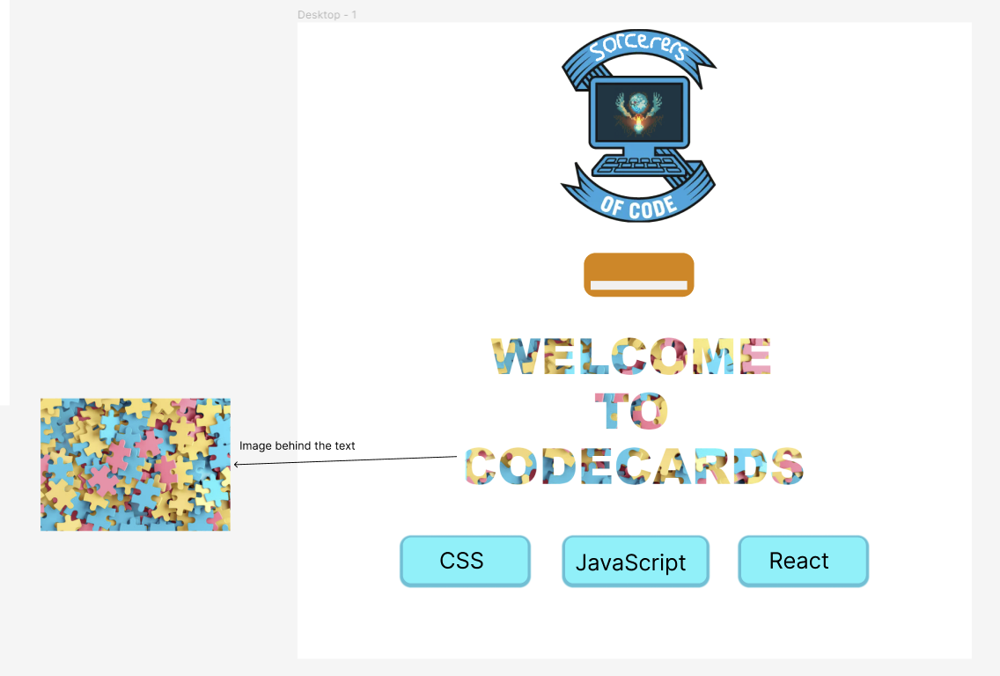
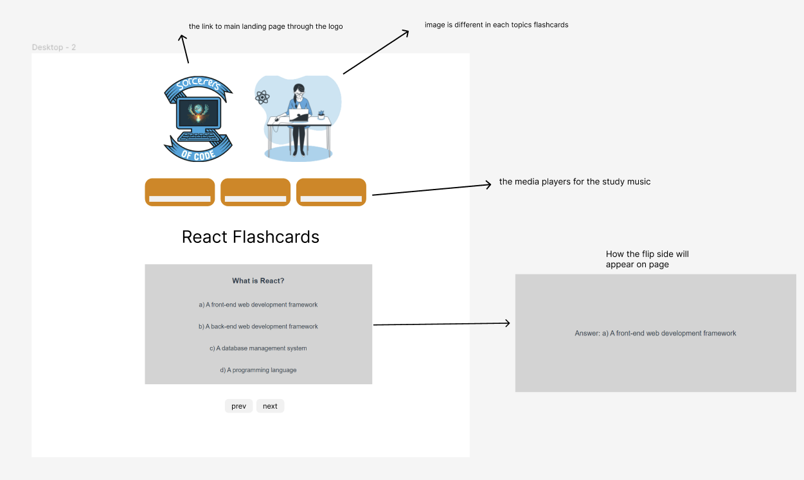

# frontend-project

## Overview
During the first 6 weeks of the bootcamp, quizzes have been useful for gauging knowledge and
keeping concepts fresh in our minds. However, all the quizzes and resources can sometimes get scattered and it is hard to keep track of revision materials.
By having one app to keep flashcards as well as useful links for various topics, we can make our learning journey easier through spaced repetition.

## User Story
```As a bootcamper, I want to be able to easily access flashcards on the weekly topics, so that I can save time and continue learning on my own schedule, using this method to build my knowledge and help me when solving coding challenges & building projects.``` 

## User Journey

 



